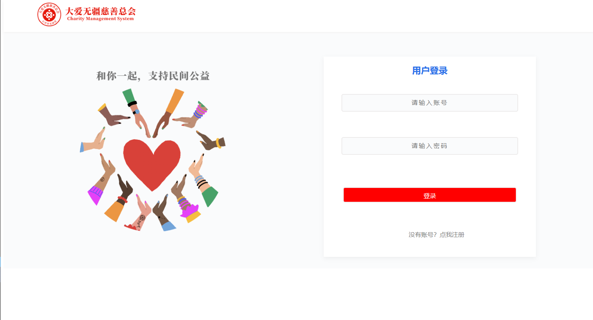
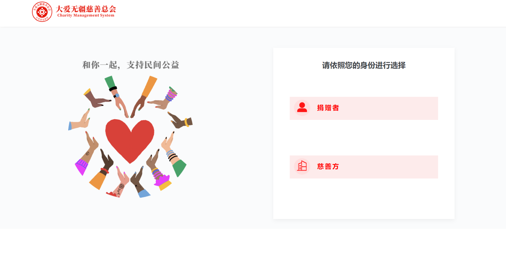
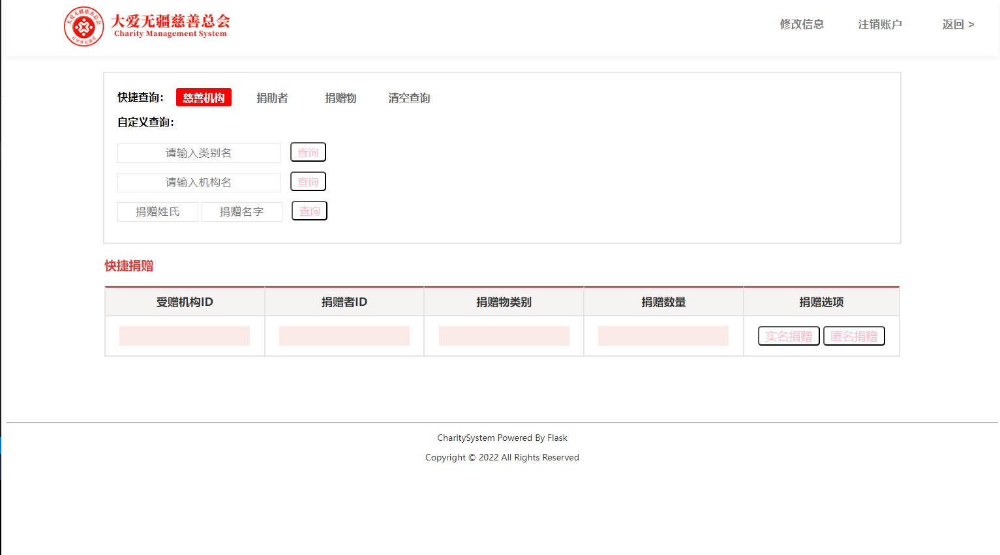
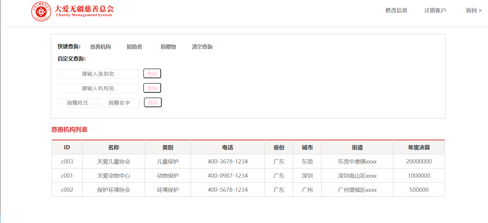

# 项目环境配置：

## 1 基础环境配置

### 1 安装 Python3

#### Debian 系列:

`sudo apt install python3`

#### RedHat 系列:

`yum install python3`

#### Arch 系列:

`pacman -S python3`

#### 查看是否安装成功:

`python3 --version`

若弹出版本信息则说明安装成功

### 2 安装 pip

#### Debian 系列:

`sudo apt install pip`

#### RedHat 系列:

`yum install pip`

#### Arch 系列:

`pacman install pip`

#### 查看是否安装成功:

`pip --version`

若弹出版本信息则说明安装成功

---

## 2 Flask 安装环境

### 1 安装虚拟环境

`sudo pip install virtualenv`

`sudo pip install virtualenvwrapper`

#### 查看是否安装成功:

`virtualenv --version`

若弹出版本信息则说明安装成功

### 2 配置环境变量

#### 1、创建目录用来存放虚拟环境

`mkdir`

`$HOME/.virtualenvs`

#### 2、打开~/.bashrc 文件，并添加如下：

`export WORKON_HOME=$HOME/.virtualenvs`

`source /usr/local/bin/virtualenvwrapper.sh`

#### 3、运行

`source ~/.bashrc`

### 3 进入虚拟环境

`workon Flask_py`

---

## 3 安装 Flask 及依赖包

`pip install flask`

#### 查看是否安装成功

`flask --version`

#### 安装后续所需的模块

`pip install -r requirements.txt`

---

## 4 安装数据库 PostgreSQL

`sudo apt install postgresql postgresql-client`

#### 查看是否安装成功

`psql --version`

# 项目启动

#### 登录 PostgreSQ

`sudo su - postgres`

`psql`

#### 创建数据库 charity

`create database charity;`

#### 在项目文件夹下打开终端

`python3 app.py`

# Flask 帮助文档使用

### 1. 将 Documents 文件夹下的`index.html` 文件拖到浏览器地址栏打开即可

### 2. Examples 文件夹下提供了与 Documents 教程对应的实例

# 官方文档

`https://dormousehole.readthedocs.io/en/2.3.2/`

# 效果展示

## 登录页

## 注册页

## 捐赠者注册页

## 慈善机构注册页

## 登陆后主页

## 登陆后查询页

# 注意事项

本程序第一版是以 PostgreSQL 数据搭建，重构后版本采用 MySQL 数据库。不同数据库搭建方式有所不同，安装好数据库后，只需配置好数据库用户名，密码和保存的数据库名即可。配置信息在 `app/config/settings.py`文件中
